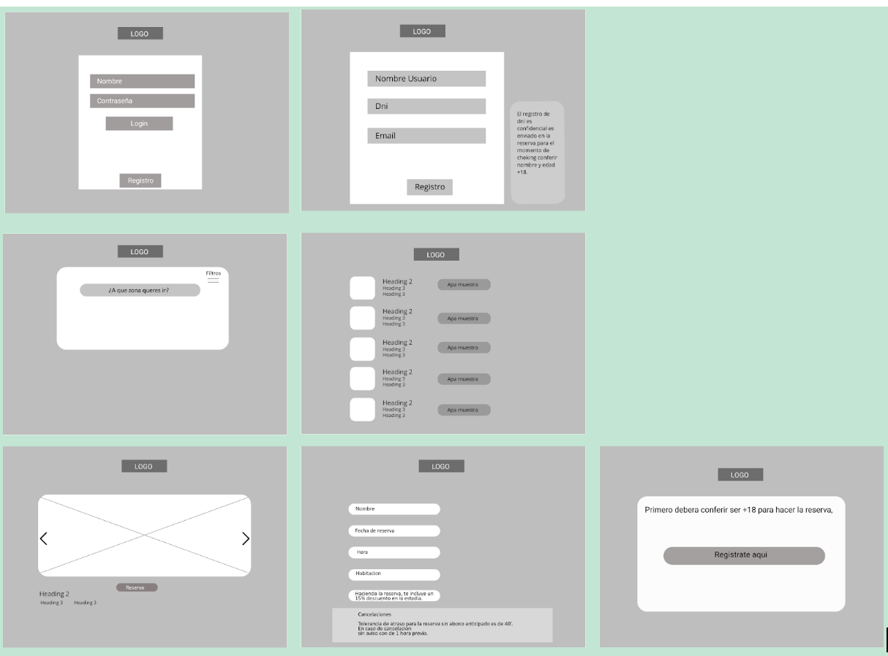
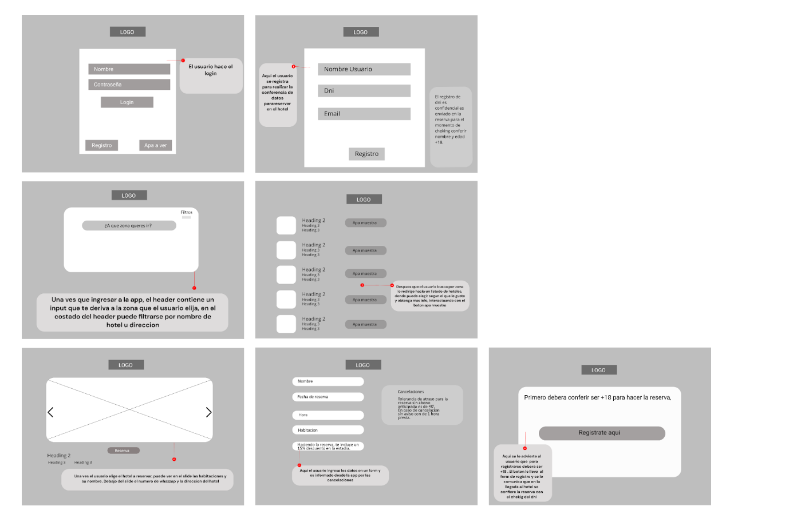

####  Readme:
# Projecto APA! 🇦🇷 
El projecto APA se inicia como una ideia desarollada en el curso de desarollo web full-stack de la escuela **DIGITAL HOUSE** a partir de la supervision del  **docente Jeronimo Sola** donde simulamos un desarollo del web site de una empresa que vende productos o presta servicio al usuario

## Integrantes
### *Rocio Suarez*
> Estudiante de programación. Por medio de la programación vi una forma de profundizar ideas asociadas con temas artísticos, haciendo de esto una oportunidad de negocio, pocas personas hacen esto en esta área. Iniciando así el aprendizaje en un curso de frontend pero para el mundo competitivo siempre se requiere más, por lo que empecé full-stack y para estar apta para el mercado._

### *Erika Botechia*
> Estudiante de medicina entusiasta del código, aprendiendo programación para arriesgarme para aplicar ideas que pueden ayudar en el mundo de las personas.  
---
## OVERVIEW Projecto APA
**STATUS**: Building Process Consruction! :hammer:  - **SPRINT #01**

**Contenido Actualizado - V: 1.0.0:**
|##|Nombre|
|--|--|
|**00**|INTEGRANTESS|
|**01**|OVERVIEW APA!  |
|**02**|BRANDING|
|**03**|WIREFRAMES|

---

---
## 01. OVERVIEW APA
---

___Brinda contestar preguntas___
1) ¿Qué productos o servicios brindará nuestro sitio? 
2) ¿Quién será nuestra audiencia objetivo?
3) ¿Cómo ajustaremos nuestra oferta a ese público?

- Nuestro servicio brinda una opción para el público conocimiento de acceso a reservas para hoteles transitorios. 
- Nuestra audiencia son los usuarios jóvenes y adultos millennials.
- Ajustamos la oferta según el parámetro de lo que el usuario esté buscando, de esa forma él/ella puede elegir según su interés.

---
## Branding APA
---
___Luego conocer a la facilidad de APP de reservas en diversas ramas identificamos la carencia de una APP eficiente identificamos la carencia de una eficiente que concluya de forma eficiente y logrando abarcar todas expectativas de un usuario que usa la APP por lo que surge APA para facilitar el placer diversión donde usuario solo tenga que concentrarse en esto sufrir STRESS para planear su momento de felicidad___

Banner + Logo Proyecto:

#### a) **Creación del Nombre:** 
Luego de pesquisar los nombres disponibles del mercado Argentino listados en la sección a seguir llegamos finalmente al nombre APA! que al hacer la referencia a una expresión popular entre todos Argentinos usamos la exclamación que refuerza el sentido de sorpresa positiva que buscamos en la experiencia del usuario con el portal además de la curiosidad que despierta y hace con que nuevos usuarios ingresen a pagina, mas allá de esto al usar un nombre que NO es estrictamente asociado al ramo principal podemos lograr 2 puntos positivos: 
- **PUNTO 01:** APA! es Discreto y Eficiente causando la curiosidad sin exponer usuarios en cuanto a búsquedas recientes
- **PUNTO 02:** Futura expansión del projecto a otras áreas del entretenimiento que pueden relacionarse con las actividades que usuarios hacen previamente en algunos contextos, como bares, restaurantes, boliches, sex shop entre otros.

___NOTA - TIPOGRAFIA, PALETA COLORES y LOGO FINAL___
> Seran anexados en SPRINT #02 en este nos preocupamos fundalmentalmente en analizar mercado y desarollar un mockup con facil usabilidad y agradavel al usuario
#### c) **Mercado Potencial :memo:** 
**Espacio de Actuacion:** Publico entre 18 y 35 años que ademas de que estes son el publico conectado
**Publico Blanco:** Publico entre 18 y 35 años que ademas del la edad es el rango que esta estrictamente asociado **REDES SOCIALES + TECNOLOGIA** la descripcion del publico llega a 
**Experiencia del usuario** Publico entre 18 y 35 años

|**Publico**|**Opnion en la Pesquisa**|
|-|-|
||**Pareja Joven 22 años**  Estudian en una facultad pública de letras, y sus compañeros de facultad suelen ir con sus parejas a un hotel cercano en balvanera. Y si no recurren a los que están por la zona de su barrio.|
| |**Mujer  - 26 años** Trabaja como asesora comercial en una marca de indumentaria, y los fines de semana, sale con un amigo y de regreso, descansan en un hotel cercano a su casa,  donde ellos disfrutan y ya conocen al recepcionista, del hotel. |
| |**Hombre - (32 años )**   Trabaja en el área de servicios en un órgano público, y hace más de un año sale con su novia y quieren descansar en nuevos lugares que no conocen y hacer un recorrido, lo hacen hace más de tres meses y están muy satisfechos. |

**Links Usados como Inspiracion del Proyecto esta basado en**
- Por los productos o servicios que ofrecen.
- Por los clientes a los que apuntan.
- Por la estética que presentan.
- Por las funcionalidades implementadas.

|**LINKs DE MERCADO**|
|-|
|https://www.motelguia.com.br/ |
|https://lafransa.com/ |
|https://loob.es/ |
|https://www.paplaza.com/ |
|https://www.luxtal.es/love-hotel/ |
|https://www.shingyoen.com/%E5%AE%A2-%E5%AE%A4 |
|https://www.hotel-newberlin.de/de |

**Conclusion de links de Mercado**
El servicio ofrecido es descansar con tu pareja en un hotel por una noche. Cada servicio ofrece distintas temáticas en sus habitaciones según la insignia que cada hotel elige para la comodidad y confort  de sus clientes y al tipo de público que el hotel apunta.
La estética que presenta es una temática, según la especialidad de cada hotel.
Sus funcionalidades dependen del valor y categoría del hotel. Cada hotel tiene un confort de calidad, según su categoría, diferencial, ofrecido para el cliente, que se ve reflejado en el costo de la habitación y del propio hotel.

#### c) **MISION APA :blue_heart: !** 
>  :blue_heart: **Surge APA para facilitar lo placer diversion donde usuario solo tenga que concentrarse en esto sufrir STRESS para planear su momento de felicidad** :blue_heart:
> **CONCLUSION** : que todos los perfiles analizados de los clienes gustarian de tener informacion de facil acceso con los principales puntos  de interes ___(Valor, conforto, opnion de otros usuarios, facilidad en reserva y opciones segun ubicacion)___ por lo que se ve viable el projecto en su publico y la area actuacion

#### MOCKUP 

> En esta parte se anexa el mockup las fotos del mockup, tambien enviados en png (la funcionalidad esta explicada a partir de las flechas con la funcion executada)

#### Esquema MOCKUPS 01

#### Esquema MOCKUPS 01

#### Esquema MOCKUPS 01

